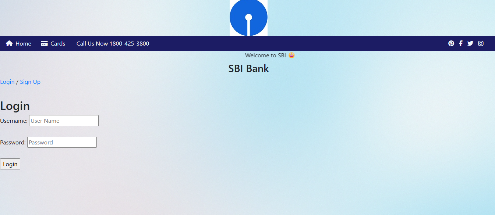

# Django Bank ATM

A Django-based ATM application featuring user authentication, balance checks, deposits, withdrawals, and card management with a secure and intuitive interface.

[](https://opensource.org/licenses/MIT)

## Table of Contents
- [Features](#features)
- [Screenshots](#screenshots)
- [Requirements](#requirements)
- [Setup](#setup)
- [Usage](#usage)
- [Project Structure](#project-structure)
- [Technologies](#technologies)
- [Troubleshooting](#troubleshooting)
- [Contributing](#contributing)
- [License](#license)

## Features
- **Secure Authentication**: Signup and login with password hashing.
- **Balance Inquiries**: Check account balances in real-time.
- **Transactions**: Perform deposits and withdrawals.
- **Card Management**: Manage card details and types.
- **Phone Activation**: Activate accounts with phone numbers.

## Screenshots
| Login Interface |
|-----------------|
|  |

## Requirements
- Python 3.13
- Django 4.2.3
- mysqlclient
- django-phonenumber-field
- XAMPP or MySQL
- Git

## Setup
1. Clone the repository:
   ```bash
   git clone https://github.com/johnkoshy/Bank-Atm-Django.git
   cd Bank-Atm-Django
   ```
2. Install Python 3.13:
   - Download from [Python 3.13.0](https://www.python.org/downloads/release/python-3130/).
   - Check "Add Python to PATH" during installation.
   - Verify installation:
     ```bash
     python --version
     ```
3. Set up a virtual environment:
   ```bash
   python -m venv venv
   ```
   - Activate it:
     - Windows:
       ```bash
       venv\Scripts\activate
       ```
     - macOS/Linux:
       ```bash
       source venv/bin/activate
       ```
4. Install dependencies:
   ```bash
   pip install django mysqlclient django-phonenumber-field
   ```
5. Set up MySQL:
   - Install XAMPP or MySQL.
   - Start MySQL, access phpMyAdmin, and create a database named `djangodb`.
   - Verify MySQL port (default: 3306):
     ```bash
     netstat -an | find "3306"  # Windows
     netstat -an | grep 3306   # macOS/Linux
     ```
6. Configure the database in `bankproject/settings.py`:
   ```python
   DATABASES = {
       'default': {
           'ENGINE': 'django.db.backends.mysql',
           'NAME': 'djangodb',
           'USER': 'root',
           'PASSWORD': '',
           'HOST': 'localhost',
           'PORT': '3306',
           'OPTIONS': {
               'init_command': "SET sql_mode='STRICT_TRANS_TABLES'"
           }
       }
   }
   ```
7. Run migrations:
   ```bash
   python manage.py makemigrations
   python manage.py migrate
   python manage.py collectstatic
   ```
8. Add test data (optional):
   ```bash
   python manage.py shell
   ```
   Execute in the shell:
   ```python
   from bankapp.models import Customer
   from django.contrib.auth.hashers import make_password
   Customer.objects.create(
       username="testuser",
       password=make_password("test123"),
       customer_name="Test User",
       balance=1000.00
   )
   ```
9. Hash existing passwords (if needed):
   ```bash
   python bankproject/hash_passwords.py
   ```
10. Start the server:
    ```bash
    python manage.py runserver
    ```
    - Access at `http://127.0.0.1:8000` using `testuser/test123`.

## Usage
1. Open `http://127.0.0.1:8000` in your browser.
2. **Login** with credentials (e.g., `testuser/test123`) or **Sign Up** for a new account.
3. Check your **Balance** on the dashboard.
4. Perform **Deposits** or **Withdrawals** via the transaction pages.
5. Manage **Card Details** or activate your account with a **Phone Number**.

## Project Structure
- **bankproject/**: Django project settings and configuration.
- **bankapp/**: Main app with models, views, and templates.
- **bankapp/models.py**: Defines models (e.g., `Customer`).
- **bankapp/views.py**: Handles request logic for authentication and transactions.
- **templates/**: HTML templates for the UI.
- **static/**: CSS, JavaScript, and static files (after `collectstatic`).
- **screenshots/**: Stores app screenshots.
- **bankproject/hash_passwords.py**: Script for hashing passwords.

## Technologies
- **Django 4.2.3**: Python web framework.
- **MySQL**: Database with `mysqlclient` connector.
- **django-phonenumber-field**: Phone number validation.
- **Python 3.13**: Programming language.
- **XAMPP**: Local development server (optional).

## Troubleshooting
- **"Table 'djangodb.customer' doesn't exist"**:
  - Ensure the `djangodb` database exists in phpMyAdmin.
  - Recreate it:
    - Drop `djangodb` in phpMyAdmin.
    - Recreate it and run:
      ```bash
      python manage.py migrate
      ```
- **Migration Issues**:
  - Reset migrations:
    ```bash
    python manage.py migrate bankapp zero --fake
    python manage.py migrate bankapp
    ```
- **MySQL Port Conflicts**:
  - Verify port 3306 is free:
    ```bash
    netstat -an | find "3306"  # Windows
    netstat -an | grep 3306   # macOS/Linux
    ```
  - Update `bankproject/settings.py` if using a different port.

## Contributing
Contributions are welcome! 🎉 For issues, suggestions, or improvements, please open an issue or submit a pull request on [GitHub](https://github.com/johnkoshy/Bank-Atm-Django/issues).

## License
This project is licensed under the [MIT License](LICENSE).